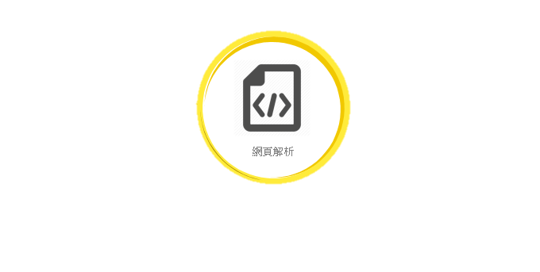

# LineBotProject

# 找工作機器人

# 廖子軒

# 簡報大綱

# 專題說明

# 研究動機

# 研究目標

# 系統架構說明

Request

Threading

Urllib

BeautifulSoup

Htmlpraser

# 目標客群

# 未來展望

AI智能推播，為求職、徵才者提供最新資訊

透過NLP分析求職者能力建立標籤、分析徵才文章取得徵才能力需求，精準分眾提供更好的媒合

